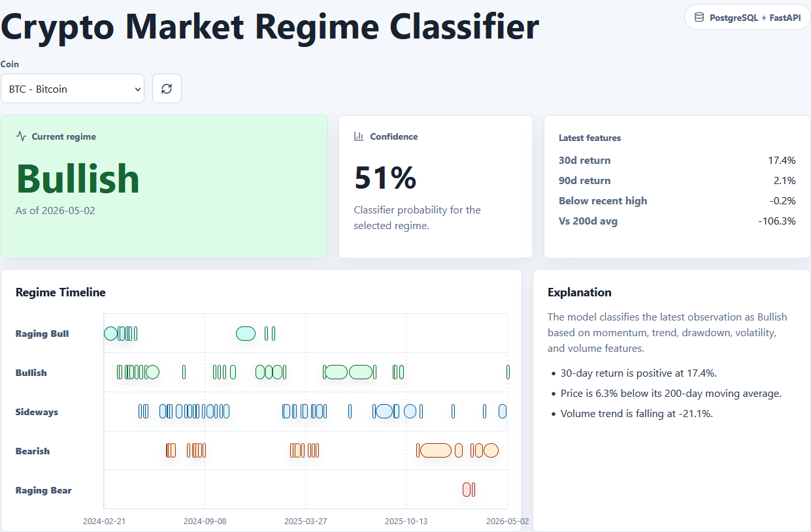
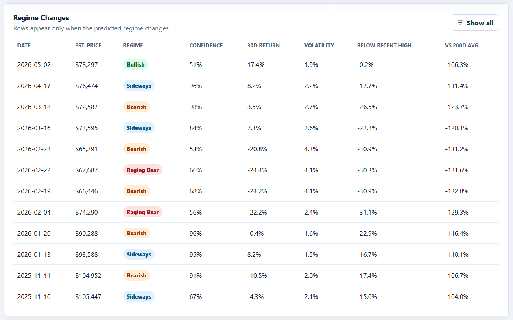

# Crypto Market Regime Classifier

A full-stack portfolio project that fetches real crypto market data, trains an explainable baseline classifier, and visualizes market regimes for BTC, ETH, SOL, LINK, and DOGE.

The app turns daily OHLCV data into rolling features such as returns, volatility, moving-average ratios, drawdown from recent highs, and volume trend. A rule-based labeling step creates five market regimes, then a scikit-learn classifier learns those regimes and writes daily predictions back to PostgreSQL for the FastAPI and React dashboard.

## Portfolio Highlights

- Built an end-to-end full-stack machine-learning dashboard from raw market data to frontend visualization.
- Designed a PostgreSQL schema for OHLCV prices, model runs, and regime predictions.
- Implemented a Python pipeline for data fetching, ingestion, feature engineering, labeling, model training, and prediction persistence.
- Exposed model outputs through FastAPI endpoints consumed by a React dashboard.
- Added explainable regime summaries based on model features rather than presenting predictions as a black box.

## Screenshots

Main dashboard view:



Regime changes table:



## What It Shows

- Current predicted regime for each supported coin
- Classifier confidence for the selected regime
- Latest momentum, drawdown, volatility, and moving-average context
- A regime timeline across real historical market data
- A table of regime-change dates, estimated price, confidence, and key features
- A short rule-based explanation for the latest prediction

## Why I Built This

Crypto dashboards usually show price charts, but they often do not explain what market condition an asset appears to be in. This project turns raw OHLCV market data into features, labels historical market regimes, trains a baseline classifier, and exposes the results through a full-stack dashboard.

The goal was to demonstrate an end-to-end product engineering workflow: data ingestion, feature engineering, model training, PostgreSQL persistence, FastAPI endpoints, and a React visualization layer.

## Stack

- Frontend: React + Vite
- Backend: FastAPI
- Database: PostgreSQL
- ML: Python, pandas, scikit-learn
- Data sources: Coinbase Exchange public candles, with optional Coinranking fallback

## How The Pipeline Works

```text
Coinbase daily candles
  -> CSV files in data/raw
  -> PostgreSQL ohlcv_prices table
  -> pandas feature engineering
  -> rule-based regime labels
  -> RandomForestClassifier training
  -> regime_predictions table
  -> FastAPI endpoints
  -> React dashboard
```

Coinbase Exchange is the primary source because its public candle endpoint returns daily OHLCV data without requiring an API key. Coinranking can be used as a fallback if you provide `COINRANKING_API_KEY`, but its price-history endpoint returns prices rather than full OHLCV candles, so fallback rows use that price for open, high, low, and close with `volume=0`.

## Project Structure

```text
backend/              FastAPI app and DB access
frontend/             React dashboard
ml/                   data fetching, ingestion, feature engineering, labels, training
db/schema.sql         PostgreSQL schema
data/raw/             local generated CSVs, ignored by git
artifacts/            local trained model outputs, ignored by git
documentation.md      detailed project notes and run order
docker-compose.yml    optional local PostgreSQL
```

## Local Setup

1. Create environment files:

```bash
cp .env.example .env
cd frontend
cp .env.example .env
cd ..
```

2. Start PostgreSQL:

```bash
docker compose up -d postgres
```

3. Create a Python virtual environment and install dependencies:

```bash
# Windows Git Bash
source .venv/Scripts/activate

# macOS/Linux
source .venv/bin/activate

pip install -r requirements.txt
```

4. Initialize the database:

```bash
psql "$DATABASE_URL" -f db/schema.sql
```

If `psql` is not on your PATH, run the schema through Docker:

```bash
docker compose exec -T postgres psql -U <POSTGRES_USER> -d <POSTGRES_DB> < db/schema.sql
```

5. Fetch real Coinbase OHLCV CSVs

```bash
python -m ml.fetch_data --source coinbase --fallback-source none --days 1000 --force
```

To smoke test one coin first:

```bash
python -m ml.fetch_data --source coinbase --fallback-source none --symbols BTC --days 1000 --force
```

6. Ingest CSV data into PostgreSQL:

```bash
python -m ml.ingest --data-dir data/raw
```

7. Train the model and write predictions:

```bash
python -m ml.train --write-db
```

8. Run the API:

```bash
uvicorn backend.app.main:app --reload --port 8000
```

9. Run the frontend:

```bash
cd frontend
npm install
npm run dev
```

Open the Vite URL shown in your terminal, usually `http://localhost:5173`.

## Resetting Local Data

If you want a clean refresh after replacing CSVs, truncate generated DB tables and rerun ingest/train:

```sql
TRUNCATE regime_predictions, model_runs, ohlcv_prices RESTART IDENTITY;
```

```bash
python -m ml.ingest --data-dir data/raw
python -m ml.train --write-db
```

## API Endpoints

- `GET /health`
- `GET /api/coins`
- `GET /api/regime/{symbol}/latest`
- `GET /api/regime/{symbol}/history`
- `GET /api/regime/{symbol}/explain`

## Validation

Current validation includes:
- API health check through `GET /health`
- Database row checks after ingestion and training
- Model metrics written to `artifacts/training_metrics.json`
- Frontend smoke test through the local Vite dashboard

Planned improvements include automated unit tests for feature generation, regime labeling, and API responses.

## Future Improvements

- Add walk-forward validation and richer model evaluation metrics.
- Add scheduled jobs for daily data refreshes and prediction updates.
- Add support for searching and classifying additional crypto assets.
- Improve chart interactions, tooltip detail, and responsive dashboard styling.
- Add deployment support for the API, database, and frontend.
- Add CI checks for formatting, linting, tests, and build validation.

## Model Notes

This is a baseline portfolio model, not a trading system or financial advice. The current labels are generated from transparent rules using momentum, moving-average ratios, volatility, and drawdown. The classifier is intended to demonstrate an explainable machine-learning workflow and can be improved with walk-forward validation, richer labeling, and live scheduled retraining.

## More Detailed Documentation

See [documentation.md](./docs/documentation.md) for a deeper file-by-file walkthrough and detailed local demo notes.
